# KeloStats Multi-Agent Architecture & Orchestration Engine

KeloStats is an enterprise-grade AI analytics and presentation generation platform. It transforms natural language queries over relational enterprise databases (PostgreSQL, MySQL, Oracle) into verified SQL, real-time data visualizations, conversational insights, and dynamic corporate slide presentations (16:9).

The system is orchestrated using **LangGraph**, featuring self-healing SQL execution loops, strict read-only security guardrails, UUID-based dynamic presentation manifests, and automated HTML/Tailwind/Chart.js validation.

---

## 1. End-to-End Architecture Diagram

```mermaid
flowchart TD
    %% Styling Classes
    classDef startNode fill:#1E293B,stroke:#38BDF8,stroke-width:2px,color:#F8FAFC;
    classDef agentNode fill:#0F172A,stroke:#6366F1,stroke-width:2px,color:#F8FAFC;
    classDef decisionNode fill:#312E81,stroke:#A855F7,stroke-width:2px,color:#F8FAFC;
    classDef toolNode fill:#14532D,stroke:#22C55E,stroke-width:2px,color:#F8FAFC;
    classDef guardNode fill:#701A75,stroke:#EC4899,stroke-width:2px,color:#F8FAFC;
    classDef repairNode fill:#B45309,stroke:#F59E0B,stroke-width:2px,color:#F8FAFC;
    classDef errorNode fill:#7F1D1D,stroke:#EF4444,stroke-width:2px,color:#F8FAFC;
    classDef storageNode fill:#1E3A8A,stroke:#3B82F6,stroke-width:2px,color:#F8FAFC;
    classDef endNode fill:#064E3B,stroke:#10B981,stroke-width:2px,color:#F8FAFC;

    %% Entry & Ingestion Layer
    API["🚀 <b>POST /api/workflow/query</b><br>User Query + DB ID + Project ID + Slide Num"]:::startNode --> LOGGER_INIT["📝 <b>Initialize LLM Logger Session</b><br>start_workflow_logger()"]:::storageNode
    LOGGER_INIT --> SAVE_USER_MSG["💬 <b>Save User Message Node</b><br>Persists query to public.chat_messages (role: 'User')"]:::storageNode
    SAVE_USER_MSG --> NODE_0A

    %% Node 0A: Query Classification Agent
    subgraph S0A["Layer 0A: Intent Classification"]
        NODE_0A["🎯 <b>Node 0A: Query Classification Agent</b><br>Classifies intent: greet | out_of_scope | in_scope"]:::agentNode
        DECIDE_INTENT{"Intent?"}:::decisionNode
        NODE_0A --> DECIDE_INTENT
    end

    DECIDE_INTENT -->|greet| GREET_HANDLER["👋 <b>Handle Greet Node</b><br>Generates welcoming Copilot greeting via LLM"]:::agentNode
    DECIDE_INTENT -->|out_of_scope| OOS_HANDLER["🛑 <b>Handle Out-of-Scope Node</b><br>Explains enterprise domain boundaries via LLM"]:::errorNode
    DECIDE_INTENT -->|in_scope| NODE_0B

    GREET_HANDLER --> SAVE_AI_MSG
    OOS_HANDLER --> SAVE_AI_MSG

    %% Node 0B: Query Decision Agent
    subgraph S0B["Layer 0B: Task Decision"]
        NODE_0B["🧠 <b>Node 0B: Query Decision Agent</b><br>Classifies in-scope task: normal_qa vs agent (slide build)"]:::agentNode
        NODE_0B --> NODE1
    end

    %% Node 1: Schema Input Layer
    subgraph S1["Layer 1: Schema Ingestion & Context"]
        NODE1["🔍 <b>Node 1: Schema Input Node</b><br>Extracts cached schema JSON from<br>databases/schema_extraction/output/{db_id}.json"]:::agentNode
        NODE1 --> SCHEMA_FORMAT["📄 <b>Format Schema for LLM</b><br>Tables, columns, types, sample values, min/max"]:::storageNode
    end

    SCHEMA_FORMAT --> NODE2

    %% Node 2: Verification Agent
    subgraph S2["Layer 2: Triage & Schema Verification"]
        NODE2["🛡️ <b>Node 2: Query Verification Agent</b><br>Validates user query against extracted schema context"]:::agentNode
        DECIDE_VERIFY{"Verification Decision?"}:::decisionNode
        NODE2 --> DECIDE_VERIFY
    end

    DECIDE_VERIFY -->|SCHEMA_MATCH| NODE3A
    DECIDE_VERIFY -->|RETRIEVAL_REQUIRED| NODE3B

    %% Node 3B: Retrieval Agent & Guardrail
    subgraph S3B["Layer 3B: Entity Value Retrieval & Search"]
        NODE3B["🔎 <b>Node 3B: Retrieval Agent</b><br>Extracts entity keywords & generates search SQL (ILIKE / LIKE)"]:::agentNode
        
        NODE3B --> GUARDRAIL_RETRIEVE{"🛡️ <b>Retrieval Guardrail</b><br>Blocks mutating keywords (DROP, DELETE, etc.)"}:::guardNode
        GUARDRAIL_RETRIEVE -->|Violation| RETRY_RETRIEVAL["🔁 <b>Retry Retrieval Agent</b><br>Corrective penalty warning (up to 3x)"]:::guardNode
        RETRY_RETRIEVAL --> NODE3B

        GUARDRAIL_RETRIEVE -->|Passed| DB_TOOL_SEARCH["⚡ <b>Execute Search Query on Target DB</b><br>PostgreSQL / MySQL / Oracle"]:::toolNode
        
        DB_TOOL_SEARCH --> CHECK_RETRIEVAL_OUT{"Execution Result?"}:::decisionNode
        
        CHECK_RETRIEVAL_OUT -->|Database Error| RETRIEVAL_ERR_STATE["⚠️ Status: <b>RETRIEVAL_REPAIR_REQUIRED</b>"]:::errorNode
        CHECK_RETRIEVAL_OUT -->|0 Rows Returned| NOT_FOUND_NODE["⚠️ <b>Status: NOT_FOUND</b><br>'the {word} not found in your database'"]:::errorNode
        CHECK_RETRIEVAL_OUT -->|>0 Rows Returned| MD_TABLE["📊 <b>Format Markdown Table</b><br>Exact values found for SQL WHERE clause"]:::storageNode
    end

    NOT_FOUND_NODE --> SAVE_AI_MSG
    MD_TABLE --> NODE3A
    RETRIEVAL_ERR_STATE --> NODE4

    %% Node 3A: Master SQL Writer Agent & Execution
    subgraph S3A["Layer 3A: Master SQL Generation & Execution"]
        NODE3A["✍️ <b>Node 3A: SQL Writer Node</b><br>Generates dialect-aware analytical SQL<br>using schema + retrieved entity table"]:::agentNode
        
        NODE3A --> GUARDRAIL_WRITER{"🛡️ <b>SQL Writer Guardrail</b><br>Enforces SELECT-only; blocks mutations"}:::guardNode
        GUARDRAIL_WRITER -->|Violation| RETRY_WRITER["🔁 <b>Retry SQL Writer Agent</b><br>Corrective penalty warning (up to 3x)"]:::guardNode
        RETRY_WRITER --> NODE3A
        
        GUARDRAIL_WRITER -->|Passed| DB_EXEC["⚡ <b>Execute Master SQL on Target DB</b><br>PostgreSQL / MySQL / Oracle"]:::toolNode
        
        DB_EXEC --> CHECK_WRITER_OUT{"Execution Result?"}:::decisionNode
        CHECK_WRITER_OUT -->|Execution Error| WRITER_ERR_STATE["⚠️ Status: <b>REPAIR_REQUIRED</b>"]:::errorNode
        CHECK_WRITER_OUT -->|Execution Succeeded| SAVE_DATA[("💾 <b>Save Query Data Payload</b><br>backend/data/{timestamp}.json<br>columns, rows, data types")]:::storageNode
    end

    WRITER_ERR_STATE --> NODE4

    %% Node 4: Centralized Self-Healing Repair
    subgraph S4_REPAIR["Layer 4: Centralized Self-Healing SQL Repair"]
        NODE4["🛠️ <b>Node 4: SQL Repair Node</b><br>SQLRepairAgent: Error + Schema + DB Dialect<br>Attempts up to 3 repair cycles"]:::repairNode
        
        NODE4 --> ROUTE_AFTER_REPAIR{"Source of Repair?"}:::decisionNode
        
        ROUTE_AFTER_REPAIR -->|Retrieval Search Query| RE_EXEC_RETRIEVAL["⚡ <b>Re-execute Search Query</b>"]:::toolNode
        RE_EXEC_RETRIEVAL --> CHECK_REPAIRED_ROWS{"Rows Found?"}:::decisionNode
        CHECK_REPAIRED_ROWS -->|0 Rows| NOT_FOUND_NODE
        CHECK_REPAIRED_ROWS -->|>0 Rows| MD_TABLE
        
        ROUTE_AFTER_REPAIR -->|Master Analytical SQL| RE_EXEC_MASTER["⚡ <b>Re-execute Master SQL & Save Data</b><br>Writes to backend/data/{timestamp}.json"]:::toolNode
        RE_EXEC_MASTER --> DECIDE_DOWNSTREAM
    end

    SAVE_DATA --> DECIDE_DOWNSTREAM{"Decision Routing?<br><i>(Evaluates Node 0B: normal_qa vs agent)</i>"}:::decisionNode

    %% Downstream Routing (Occurs after SQL Execution & Data Fetch)
    DECIDE_DOWNSTREAM -->|decision == 'normal_qa'| NODE5
    DECIDE_DOWNSTREAM -->|decision == 'agent'| NODE6

    %% Node 5: Answer Generator
    subgraph S5_QA["Layer 5: Conversational QA Synthesis"]
        NODE5["💬 <b>Node 5: Answer Generator Node</b><br>Synthesizes direct conversational answer & metrics<br>grounded strictly in executed SQL data"]:::agentNode
    end
    NODE5 --> SAVE_AI_MSG

    %% Nodes 6 & 7: PPT Generation & HTML Validation
    subgraph S6_PPT["Layer 6: Dynamic Presentation Engine"]
        NODE6["🎨 <b>Node 6: PPT Generation Node</b><br>Reads manifest.json for Slide {n} (UUID.html)<br>Case 1: Empty Canvas -> uses previous slide template<br>Case 2: Existing Canvas -> updates active slide<br>Generates HTML5 / Tailwind / Chart.js"]:::agentNode
        
        NODE6 --> NODE7["✅ <b>Node 7: HTML Code Validation Node</b><br>Inspects slide layout for 16:9 ratio, broken CSS,<br>overlapping divs, and JavaScript/Chart.js syntax errors"]:::guardNode

        NODE7 --> S3_SAVE[("☁️ <b>Persist Validated Slide to S3</b><br>workspace/{user_id}/{project_id}/slides/{uuid}.html<br>via manifest.json")]:::storageNode
    end

    S6_PPT --> SAVE_AI_MSG

    %% Exit & Persistence Layer
    subgraph S_FINAL["Layer 7: Response Persistence & Observability"]
        SAVE_AI_MSG["💾 <b>Save AI Response Node</b><br>Persists Copilot answer / confirmation to<br>public.chat_messages (role: 'AI')"]:::storageNode
        
        SAVE_AI_MSG --> WORKFLOW_END["🏁 <b>LangGraph Final State</b>"]:::endNode
        WORKFLOW_END --> FINALIZE_LOG[("📜 <b>Save Final LLM Log Session</b><br>logs/llm_logs/workflow Log {timestamp}.txt<br>prompts, completions & token telemetry")]:::storageNode
    end
```



---

## 2. Core State Schema (`KelostatsGraphState`)

The state passed across all LangGraph nodes is strictly typed:

| State Key | Type | Description |
|---|---|---|
| `user_query` | `str` | Raw natural language input from the user |
| `database_id` | `Optional[str]` | Target connected database ID |
| `project_id` | `Optional[str]` | Active presentation project ID in Supabase/PostgreSQL |
| `user_id` | `Optional[str]` | Authenticated user ID |
| `slide_number` | `Optional[int]` | Active slide index (1-based) being viewed or edited |
| `classification_intent` | `Optional[str]` | `"greet"` \| `"out_of_scope"` \| `"in_scope"` |
| `classification_reason` | `Optional[str]` | Explanation from `QueryClassificationAgent` |
| `decision` | `Optional[str]` | `"normal_qa"` (direct data question) \| `"agent"` (generate/edit slides) |
| `decision_reason` | `Optional[str]` | Explanation from `QueryDecisionAgent` |
| `llm_prompt_text` | `Optional[str]` | Rich formatted schema text with columns, types, sample categories, min/max |
| `verification_status` | `Optional[str]` | `"SCHEMA_MATCH"` \| `"RETRIEVAL_REQUIRED"` |
| `verification_reason` | `Optional[str]` | Reasoning provided by `QueryVerifyAgent` |
| `retrieved_markdown_table` | `Optional[str]` | Markdown table of verified database entity values for WHERE clause |
| `generated_sql` | `Optional[str]` | Dialect-compliant SQL query generated by `SQLWriterAgent` |
| `sql_error` | `Optional[str]` | Exception traceback string if query execution fails |
| `retrieved_data` | `Optional[Dict[str, Any]]` | Execution payload `{"columns": [...], "rows": [...]}` |
| `retrieved_rows_count` | `Optional[int]` | Number of records returned by the master query |
| `generated_slide_html` | `Optional[str]` | Raw 16:9 slide HTML5 code produced by `PPTGenerationAgent` |
| `final_output` | `Optional[str]` | Conversational response displayed in Copilot chat |
| `status` | `Optional[str]` | Current operational lifecycle status string |

---

## 3. Workflow Layer Breakdown

### Layer 0: Entry, Ingestion & Intent Triage
1. **`save_user_message_node`**:
   - Persists the user's prompt into `public.chat_messages` table (`role: 'User'`) linked to `project_id`.
2. **`query_classification_node` (`QueryClassificationAgent`)**:
   - Classifies query into:
     - `greet`: Handled by `handle_greet_node` with a dynamic AI welcoming response.
     - `out_of_scope`: Handled by `handle_out_of_scope_node` explaining analytical capabilities.
     - `in_scope`: Passes to task decision.
3. **`query_decision_node` (`QueryDecisionAgent`)**:
   - Distinguishes user intent:
     - `normal_qa`: Direct inquiry asking for numbers, summaries, or telemetry.
     - `agent`: Directive to generate, redesign, or update presentation slides.

### Layer 1 & 2: Schema Context & Verification
1. **`schema_input_node`**:
   - Loads cached database schema (`databases/schema_extraction/output/{db_id}.json` / `.txt`).
   - Converts tables, column types, statistics, and sample values into structured LLM prompt text.
2. **`verification_agent_node` (`QueryVerifyAgent`)**:
   - Validates how the query should be fulfilled against schema tables and columns:
     - `SCHEMA_MATCH`: Direct SQL generation.
     - `RETRIEVAL_REQUIRED`: Ambiguous entity values requiring value search (e.g., country names, product codes).
   - *Note: `UNRELATED` was removed from verification because general non-database / out-of-scope requests are already triaged upfront at Layer 0A by `QueryClassificationAgent` (`out_of_scope`).*

### Layer 3: Entity Retrieval & Master SQL Generation
1. **`retrieval_agent_node` (`RetrievalAgent`)**:
   - Generates case-insensitive search queries (`ILIKE` / `LIKE`) to locate exact categorical matches.
   - Built-in regex guardrails block mutating SQL keywords.
   - If 0 rows return, halts with user-friendly "not found in database" message.
   - If rows return, formats an entity Markdown table for the SQL writer.
2. **`sql_writer_node` (`SQLWriterAgent`)**:
   - Synthesizes dialect-aware SQL (PostgreSQL, MySQL, Oracle).
   - Enforces read-only safety guardrail (strictly blocks `INSERT`, `UPDATE`, `DELETE`, `DROP`, `ALTER`, etc.).
   - Executes SQL and writes records to `backend/data/{timestamp}.json`.
   - On database execution error, transitions status to `REPAIR_REQUIRED`.

### Layer 4: Centralized Self-Healing SQL Repair
1. **`sql_repair_node` (`SQLRepairAgent`)**:
   - Triggered automatically when retrieval search or master SQL fails execution.
   - Analyzes target database error message, schema structure, and invalid SQL.
   - Performs up to 3 iterative repair attempts.
   - Re-executes repaired query and routes state back to normal execution pipelines.

### Why Decision Routing Branches After the SQL Pipeline

> [!NOTE]
> 1. **Early Intent Classification (Node 0B)**: `QueryDecisionAgent` determines whether the query requires a direct text answer (`normal_qa`) or a presentation slide (`agent`).
> 2. **Shared Ground-Truth Engine (Layers 1-4)**: Both direct answers and presentation slides require real, verified database records. Hence, both paths pass through the same schema verification, SQL generation, and self-healing repair execution engine.
> 3. **Post-SQL Branching**: Once SQL execution completes and data rows are stored in `backend/data/{timestamp}.json`, LangGraph evaluates `state["decision"]` to branch downstream:
>    - `normal_qa` &rarr; **Node 5 (Answer Generator)** for natural language answers.
>    - `agent` &rarr; **Node 6 (PPT Generator)** & **Node 7 (HTML Validator)** for 16:9 presentation slides.

### Layer 5 & 6: Conversational QA & Slide Synthesis
1. **`answer_generator_node` (`AnswerGeneratorAgent`)**:
   - Triggered when `decision == "normal_qa"`.
   - Formulates natural language explanations, key metrics, and bulleted takeaways grounded solely in retrieved database rows.
2. **`ppt_generation_node` (`PPTGenerationAgent`)**:
   - Triggered when `decision == "agent"`.
   - **Dynamic Manifest Resolution**: Uses `workspace/{user_id}/{project_id}/manifest.json` to identify active slide UUID (`{uuid}.html`).
   - **Case 1 (Empty Slide)**: If the target slide has no content, inherits theme, color palette, and layout from the previous content slide.
   - **Case 2 (Slide with Content)**: Uses existing slide canvas as template to update text, tables, and charts.
   - Generates responsive, standalone 16:9 HTML with Tailwind CSS and Chart.js telemetry charts.
3. **`validate_html_code_node` (`ValidateHTMLCodeAgent`)**:
   - Post-processes generated HTML code.
   - Detects and repairs broken aspect ratios, overlapping divs, missing script tags, and JavaScript syntax bugs (such as invalid `calc()` inside JS objects).
   - Persists validated HTML back to Supabase S3.
   - Sets a polite chat confirmation message (never dumps raw code into Copilot chat).

### Layer 7: Exit & Observability
1. **`save_ai_response_node`**:
   - Writes final output message to `public.chat_messages` (`role: 'AI'`).
2. **Workflow LLM Logger (`logs/llm_logger.py`)**:
   - Flushes step-by-step agent prompts, completions, and token usage into `backend/logs/llm_logs/workflow Log {timestamp}.txt`.

---

## 4. Workspace & Storage Architecture

```
Supabase S3 Bucket ('workspace')
└── workspace/
    └── {user_id}/
        └── {project_id}/
            ├── manifest.json                  <-- Tracks slide ordering & UUID mappings
            └── slides/
                ├── 3f1a2b3c-4d5e-...html      <-- Standalone 16:9 HTML slide
                ├── 8e9f0a1b-2c3d-...html
                └── ...
```

### Manifest Format (`manifest.json`)
```json
[
  {
    "filename": "3f1a2b3c-4d5e-4179-be1f-5d6554850ebe.html",
    "count": 1
  },
  {
    "filename": "8e9f0a1b-2c3d-42d9-a98f-d52f903491a3.html",
    "count": 2
  }
]
```
- Slide additions or deletions anywhere in the deck adjust the order sequence `count` dynamically without requiring file renames.

### Relational Database Schema (`public`)
- **`user_databases`**: Stores encrypted credentials, dialect type, and user-defined `display_name`.
- **`workspace`**: Projects mapped to user, database, and template.
- **`chat_messages`**: Persistent chat thread history between User and AI Copilot.
- **`templates`**: Presentation design systems and theme definitions.
