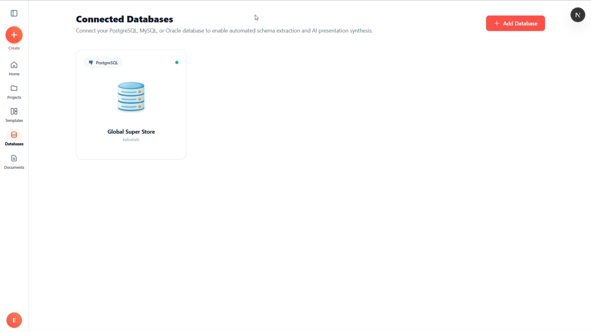
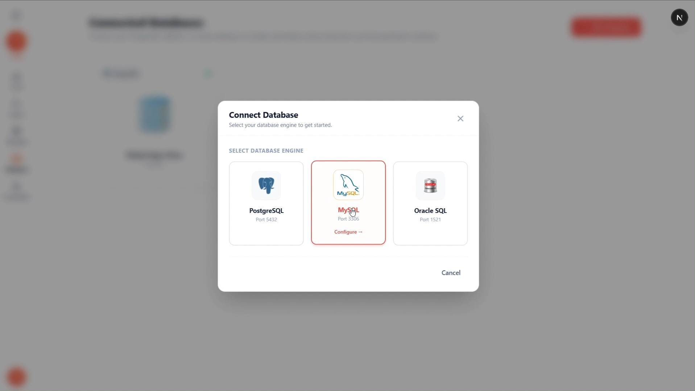
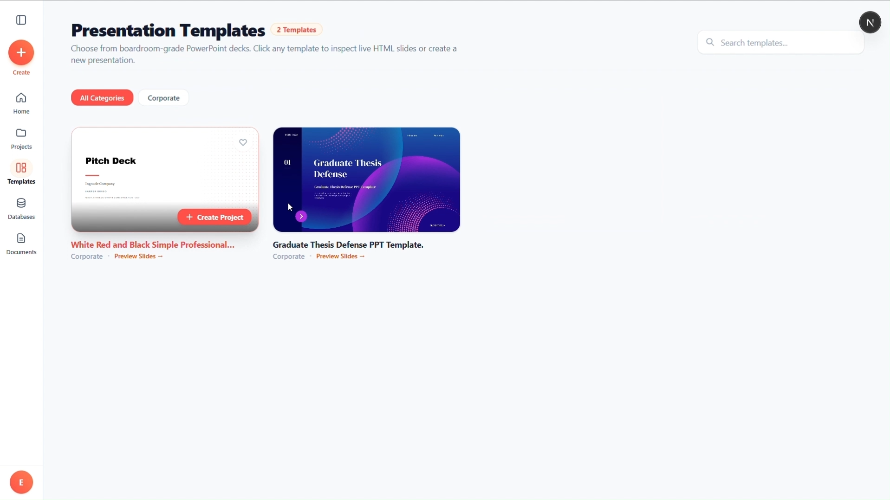
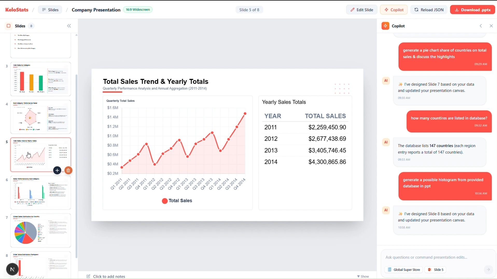
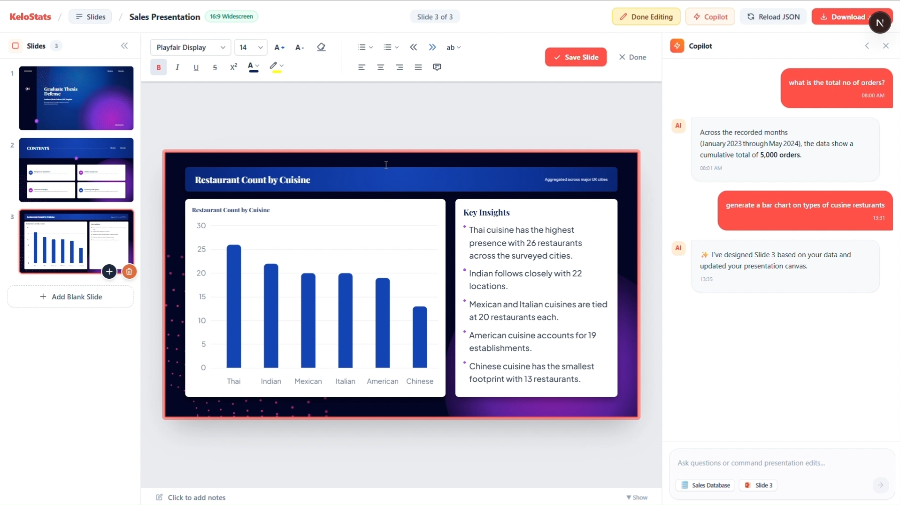

# 📊 KeloStats — Enterprise Multi-Agent AI Analytics & Presentation Engine

**Transforming natural language queries into verified SQL, real-time data visualizations, conversational analytics, and dynamic boardroom-grade 16:9 slide decks.**

---

## 🎯 1. Project Agenda & Problem Solving

### The Problem
In modern enterprises, data is trapped in relational databases (PostgreSQL, MySQL, Oracle) and unstructured documents. Extracting insights requires technical SQL expertise, while communicating those findings to executives demands hours of manual slide building in PowerPoint. 

Common bottlenecks include:
- **SQL Complexity & Hallucination:** Standard LLMs frequently hallucinate column names, misunderstand dialect nuances, or fail on specific categorical filters.
- **Data-to-Presentation Disconnect:** Manually copying data tables, crafting charts, and formatting corporate presentations is tedious and error-prone.
- **Lack of Verification & Safety:** Direct Text-to-SQL without strict read-only guardrails poses database corruption risks.

### The Agenda & Solution
**KeloStats** is an autonomous, multi-agent AI system orchestrated with **LangGraph** that bridges the gap between raw enterprise data and executive storytelling:

1. **Self-Healing Text-to-SQL:** Automatically extracts database schemas, resolves ambiguous entities via targeted retrieval, writes dialect-compliant queries, and self-repairs failed SQL up to 3 iterative cycles.
2. **Strict Guardrails:** Enforces read-only database execution to guarantee database integrity.
3. **Planner-Compiler Presentation Engine:** Translates raw database rows into spatial slide layout plans (1920×1080 canvas), compiling them into responsive HTML5, Tailwind CSS, and Chart.js slides stored in Supabase S3.
4. **Hybrid Document & Knowledge RAG:** Ingests unstructured corporate documents alongside structured relational databases for holistic enterprise answers.

---

## 📸 2. Screenshots Showcase

<table width="100%">
  <tr>
    <td width="50%" align="center" valign="top">
      <h4>1. Database Integration & Management</h4>
      
      
<i>Connect PostgreSQL, MySQL, and Oracle instances with real-time schema extraction and telemetry.</i>

    </td>
    <td width="50%" align="center" valign="top">
      <h4>2. Multi-Source Database Selector</h4>
      
      
<i>Easily switch between connected databases to contextualize queries and presentations.</i>

    </td>
  </tr>
  <tr>
    <td width="50%" align="center" valign="top">
      <h4>3. Boardroom Presentation Templates</h4>
      
      
<i>Curated 16:9 executive templates ready to be populated with live analytical data.</i>

    </td>
    <td width="50%" align="center" valign="top">
      <h4>4. Conversational AI Copilot</h4>
      
      
<i>Interact in natural language to query metrics, request slide redesigns, and get instant answers.</i>

    </td>
  </tr>
  <tr>
    <td colspan="2" align="center" valign="top">
      <h4>5. Dynamic 16:9 Slide Canvas & Editor</h4>
      
      
<i>Real-time editable canvas rendering responsive HTML5, Chart.js visualizations, and Tailwind typography.</i>

    </td>
  </tr>
</table>

---

## 🏛️ 3. Architecture

KeloStats operates on a stateful, multi-agent orchestration architecture powered by **LangGraph**. The workflow decouples query classification, schema verification, entity retrieval, SQL generation, self-healing repair, conversational synthesis, and slide compilation.

### End-to-End Workflow Diagram

```mermaid
flowchart TD
    %% Styling Classes
    classDef startNode fill:#1E293B,stroke:#38BDF8,stroke-width:2px,color:#F8FAFC;
    classDef agentNode fill:#0F172A,stroke:#6366F1,stroke-width:2px,color:#F8FAFC;
    classDef decisionNode fill:#312E81,stroke:#A855F7,stroke-width:2px,color:#F8FAFC;
    classDef toolNode fill:#14532D,stroke:#22C55E,stroke-width:2px,color:#F8FAFC;
    classDef guardNode fill:#701A75,stroke:#EC4899,stroke-width:2px,color:#F8FAFC;
    classDef repairNode fill:#B45309,stroke:#F59E0B,stroke-width:2px,color:#F8FAFC;
    classDef errorNode fill:#7F1D1D,stroke:#EF4444,stroke-width:2px,color:#F8FAFC;
    classDef storageNode fill:#1E3A8A,stroke:#3B82F6,stroke-width:2px,color:#F8FAFC;
    classDef endNode fill:#064E3B,stroke:#10B981,stroke-width:2px,color:#F8FAFC;

    %% Entry & Ingestion Layer
    API["🚀 <b>POST /api/workflow/query</b><br>User Query + DB ID + Project ID + Slide Num"]:::startNode --> LOGGER_INIT["📝 <b>Initialize LLM Logger Session</b><br>start_workflow_logger()"]:::storageNode
    LOGGER_INIT --> SAVE_USER_MSG["💬 <b>Save User Message Node</b><br>Persists query to public.chat_messages (role: 'User')"]:::storageNode
    SAVE_USER_MSG --> NODE_0A

    %% Node 0A: Query Classification Agent
    subgraph S0A["Layer 0A: Intent Classification"]
        NODE_0A["🎯 <b>Node 0A: Query Classification Agent</b><br>Classifies intent: greet | out_of_scope | in_scope"]:::agentNode
        DECIDE_INTENT{"Intent?"}:::decisionNode
        NODE_0A --> DECIDE_INTENT
    end

    DECIDE_INTENT -->|greet| GREET_HANDLER["👋 <b>Handle Greet Node</b><br>Generates welcoming Copilot greeting via LLM"]:::agentNode
    DECIDE_INTENT -->|out_of_scope| OOS_HANDLER["🛑 <b>Handle Out-of-Scope Node</b><br>Explains enterprise domain boundaries via LLM"]:::errorNode
    DECIDE_INTENT -->|in_scope| NODE_0B

    GREET_HANDLER --> SAVE_AI_MSG
    OOS_HANDLER --> SAVE_AI_MSG

    %% Node 0B: Query Decision Agent
    subgraph S0B["Layer 0B: Task Decision"]
        NODE_0B["🧠 <b>Node 0B: Query Decision Agent</b><br>Classifies: normal_qa vs agent<br>Sub-agent: QueryDecisionClassifyAgent (sql_required: true/false)"]:::agentNode
        DECIDE_SQL{"SQL Required?"}:::decisionNode
        NODE_0B --> DECIDE_SQL
    end

    DECIDE_SQL -->|"Yes (normal_qa or data slide)"| NODE1
    DECIDE_SQL -->|"No (Direct slide edit/styling)"| NODE6

    %% Node 1: Schema Input Layer
    subgraph S1["Layer 1: Schema Ingestion & Context"]
        NODE1["🔍 <b>Node 1: Schema Input Node</b><br>Extracts cached schema JSON from<br>databases/schema_extraction/output/{db_id}.json"]:::agentNode
        NODE1 --> SCHEMA_FORMAT["📄 <b>Format Schema for LLM</b><br>Tables, columns, types, sample values, min/max"]:::storageNode
    end

    SCHEMA_FORMAT --> NODE2

    %% Node 2: Verification Agent
    subgraph S2["Layer 2: Triage & Schema Verification"]
        NODE2["🛡️ <b>Node 2: Query Verification Agent</b><br>Validates user query against extracted schema context"]:::agentNode
        DECIDE_VERIFY{"Verification Decision?"}:::decisionNode
        NODE2 --> DECIDE_VERIFY
    end

    DECIDE_VERIFY -->|SCHEMA_MATCH| NODE3A
    DECIDE_VERIFY -->|RETRIEVAL_REQUIRED| NODE3B

    %% Node 3B: Retrieval Agent & Guardrail
    subgraph S3B["Layer 3B: Entity Value Retrieval & Search"]
        NODE3B["🔎 <b>Node 3B: Retrieval Agent</b><br>Extracts entity keywords & generates search SQL (ILIKE / LIKE)"]:::agentNode
        
        NODE3B --> GUARDRAIL_RETRIEVE{"🛡️ <b>Retrieval Guardrail</b><br>Blocks mutating keywords (DROP, DELETE, etc.)"}:::guardNode
        GUARDRAIL_RETRIEVE -->|Violation| RETRY_RETRIEVAL["🔁 <b>Retry Retrieval Agent</b><br>Corrective penalty warning (up to 3x)"]:::guardNode
        RETRY_RETRIEVAL --> NODE3B

        GUARDRAIL_RETRIEVE -->|Passed| DB_TOOL_SEARCH["⚡ <b>Execute Search Query on Target DB</b><br>PostgreSQL / MySQL / Oracle"]:::toolNode
        
        DB_TOOL_SEARCH --> CHECK_RETRIEVAL_OUT{"Execution Result?"}:::decisionNode
        
        CHECK_RETRIEVAL_OUT -->|Database Error| RETRIEVAL_ERR_STATE["⚠️ Status: <b>RETRIEVAL_REPAIR_REQUIRED</b>"]:::errorNode
        CHECK_RETRIEVAL_OUT -->|0 Rows Returned| NOT_FOUND_NODE["⚠️ <b>Status: NOT_FOUND</b><br>'the {word} not found in your database'"]:::errorNode
        CHECK_RETRIEVAL_OUT -->|>0 Rows Returned| MD_TABLE["📊 <b>Format Markdown Table</b><br>Exact values found for SQL WHERE clause"]:::storageNode
    end

    NOT_FOUND_NODE --> SAVE_AI_MSG
    MD_TABLE --> NODE3A
    RETRIEVAL_ERR_STATE --> NODE4

    %% Node 3A: Master SQL Writer Agent & Execution
    subgraph S3A["Layer 3A: Master SQL Generation & Execution"]
        NODE3A["✍️ <b>Node 3A: SQL Writer Node</b><br>Generates dialect-aware analytical SQL<br>using schema + retrieved entity table"]:::agentNode
        
        NODE3A --> GUARDRAIL_WRITER{"🛡️ <b>SQL Writer Guardrail</b><br>Enforces SELECT-only; blocks mutations"}:::guardNode
        GUARDRAIL_WRITER -->|Violation| RETRY_WRITER["🔁 <b>Retry SQL Writer Agent</b><br>Corrective penalty warning (up to 3x)"]:::guardNode
        RETRY_WRITER --> NODE3A
        
        GUARDRAIL_WRITER -->|Passed| DB_EXEC["⚡ <b>Execute Master SQL on Target DB</b><br>PostgreSQL / MySQL / Oracle"]:::toolNode
        
        DB_EXEC --> CHECK_WRITER_OUT{"Execution Result?"}:::decisionNode
        CHECK_WRITER_OUT -->|Execution Error| WRITER_ERR_STATE["⚠️ Status: <b>REPAIR_REQUIRED</b>"]:::errorNode
        CHECK_WRITER_OUT -->|Execution Succeeded| SAVE_DATA[("💾 <b>Save Query Data Payload</b><br>backend/data/{timestamp}.json<br>columns, rows, data types")]:::storageNode
    end

    WRITER_ERR_STATE --> NODE4

    %% Node 4: Centralized Self-Healing Repair
    subgraph S4_REPAIR["Layer 4: Centralized Self-Healing SQL Repair"]
        NODE4["🛠️ <b>Node 4: SQL Repair Node</b><br>SQLRepairAgent: Error + Schema + DB Dialect<br>Attempts up to 3 repair cycles"]:::repairNode
        
        NODE4 --> ROUTE_AFTER_REPAIR{"Source of Repair?"}:::decisionNode
        
        ROUTE_AFTER_REPAIR -->|Retrieval Search Query| RE_EXEC_RETRIEVAL["⚡ <b>Re-execute Search Query</b>"]:::toolNode
        RE_EXEC_RETRIEVAL --> CHECK_REPAIRED_ROWS{"Rows Found?"}:::decisionNode
        CHECK_REPAIRED_ROWS -->|0 Rows| NOT_FOUND_NODE
        CHECK_REPAIRED_ROWS -->|>0 Rows| MD_TABLE
        
        ROUTE_AFTER_REPAIR -->|Master Analytical SQL| RE_EXEC_MASTER["⚡ <b>Re-execute Master SQL & Save Data</b><br>Writes to backend/data/{timestamp}.json"]:::toolNode
        RE_EXEC_MASTER --> DECIDE_DOWNSTREAM
    end

    SAVE_DATA --> DECIDE_DOWNSTREAM{"Decision Routing?<br><i>(Evaluates Node 0B: normal_qa vs agent)</i>"}:::decisionNode

    %% Downstream Routing (Occurs after SQL Execution & Data Fetch)
    DECIDE_DOWNSTREAM -->|decision == 'normal_qa'| NODE5
    DECIDE_DOWNSTREAM -->|decision == 'agent'| NODE5_5

    %% Node 5: Answer Generator
    subgraph S5_QA["Layer 5: Conversational QA Synthesis"]
        NODE5["💬 <b>Node 5: Answer Generator Node</b><br>Synthesizes direct conversational answer & metrics<br>grounded strictly in executed SQL data"]:::agentNode
    end
    NODE5 --> SAVE_AI_MSG

    %% Nodes 5.5, 6 & 7: PPT Planning, Generation & HTML Validation
    subgraph S6_PPT["Layer 6: Dynamic Presentation Engine (Planner-Compiler Architecture)"]
        NODE5_5["📐 <b>Node 5.5: Slide Planning Agent</b><br>Translates query & retrieved rows into structured JSON layout<br>Generates components & exact 1920x1080 bounding box locations"]:::agentNode
        
        NODE5_5 --> NODE6["🎨 <b>Node 6: PPT Generation Node</b><br>Compiles structured slide_plan JSON into HTML5 / Tailwind / Chart.js<br>Case 1: Empty Canvas -> uses previous slide template<br>Case 2: Existing Canvas -> updates active slide<br><i>(Raw database rows NOT passed directly to HTML generator)</i>"]:::agentNode
        
        NODE6 --> NODE7["✅ <b>Node 7: HTML Code Validation Node</b><br>Inspects slide layout for 16:9 ratio, broken CSS,<br>overlapping divs, and JavaScript/Chart.js syntax errors"]:::guardNode

        NODE7 --> S3_SAVE[("☁️ <b>Persist Validated Slide to S3</b><br>workspace/{user_id}/{project_id}/slides/{uuid}.html<br>via manifest.json")]:::storageNode
    end

    NODE6 --> SAVE_AI_MSG

    %% Exit & Persistence Layer
    subgraph S_FINAL["Layer 7: Response Persistence & Observability"]
        SAVE_AI_MSG["💾 <b>Save AI Response Node</b><br>Persists Copilot answer / confirmation to<br>public.chat_messages (role: 'AI')"]:::storageNode
        
        SAVE_AI_MSG --> WORKFLOW_END["🏁 <b>LangGraph Final State</b>"]:::endNode
        WORKFLOW_END --> FINALIZE_LOG[("📜 <b>Save Final LLM Log Session</b><br>logs/llm_logs/workflow Log {timestamp}.txt<br>prompts, completions & token telemetry")]:::storageNode
    end
```

### Architectural Highlights
- **Layer 0 (Intent & Task Classification):** Distinguishes greetings, out-of-scope queries, data questions (`normal_qa`), and slide directives (`agent`). Fast-paths direct styling/title updates directly to slide editing without unnecessary SQL lookups.
- **Layer 1 & 2 (Schema Context & Verification):** Ingests rich table statistics and sample values; identifies if entity searches (e.g., specific customer or product names) are required.
- **Layer 3 & 4 (Retrieval, SQL Writing & Self-Healing Repair):** Generates dialect-aware SQL with strict read-only regex guardrails. If execution encounters an error, the `SQLRepairAgent` self-corrects the query up to 3 cycles.
- **Layer 5 & 6 (Planner-Compiler Pattern for Presentations):**
  - **SlidePlanningAgent:** Computes non-overlapping spatial layouts on a `1920×1080` canvas, outputting a strict component plan.
  - **PPTGenerationAgent:** Compiles the layout into responsive HTML5, Tailwind CSS, and Chart.js code without ever seeing messy raw database rows.
  - **ValidateHTMLCodeAgent:** Ensures valid 16:9 ratio, scripts, and syntax before persisting to cloud storage.
- **Storage Layer:** Slides are uniquely keyed via UUIDs in Supabase S3 under `workspace/{user_id}/{project_id}/slides/{uuid}.html` and ordered dynamically via `manifest.json`.

---

## 🛠️ 4. Tech Stack

| Category | Technology | Purpose |
|---|---|---|
| **Frontend** | **Next.js 14 (App Router)** | Modern full-stack React framework with SSR and responsive UI |
| | **TypeScript** | Type-safe enterprise frontend code |
| | **Tailwind CSS** | Styling, theme gradients, glassmorphism, and responsive layout |
| | **Lucide React** | Clean, accessible UI icons |
| **Backend & API** | **FastAPI** | High-performance asynchronous Python REST API |
| | **Uvicorn** | ASGI web server implementation |
| | **Pydantic v2** | Data validation and settings management |
| **Multi-Agent Engine** | **LangGraph** | Stateful cyclical graph orchestration with branching decision logic |
| | **LangChain Core** | Agent abstraction, prompt management, and tool integration |
| **AI & Inference** | **Groq Cloud** | Ultra-low latency inference (`llama-3.3-70b-versatile`, `gpt-oss-120b`) |
| | **Sentence Transformers** | Dense vector embeddings (`all-MiniLM-L6-v2`) for hybrid RAG |
| **Databases** | **PostgreSQL + pgvector** | Metadata, chat history, and semantic vector similarity search |
| | **MySQL & Oracle DB** | Supported connected enterprise customer databases |
| | **SQLAlchemy** | Unified connection pooling and multi-dialect query execution |
| **Auth & Cloud Storage** | **Supabase Auth (GoTrue)** | JWT-based authentication and secure session tokens |
| | **Supabase Storage (S3)** | S3-compatible cloud storage for presentations, slide HTMLs, & documents |
| **Visuals & Slides** | **Chart.js** | Dynamic analytical charts (Bar, Line, Doughnut) inside slides |
| | **HTML5 16:9 Canvas** | Standard widescreen presentations with container queries (`cqw`) |
| | **python-pptx** | PowerPoint export and slide generation engine |

---

## 💡 5. Conclusion

**KeloStats** redefines how organizations interact with enterprise databases. By eliminating the manual pipeline of data extraction, SQL debugging, chart crafting, and slide formatting, KeloStats turns hours of tedious work into a seamless conversational interaction.

With its **self-healing multi-agent architecture**, **strict read-only safety guardrails**, and **planner-compiler presentation engine**, KeloStats delivers reliable, boardroom-ready intelligence directly from raw enterprise data—fast, accurate, and secure.
