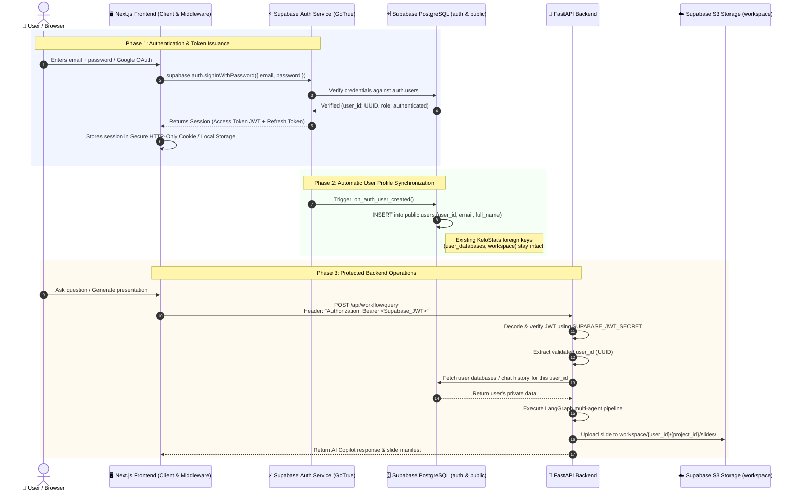
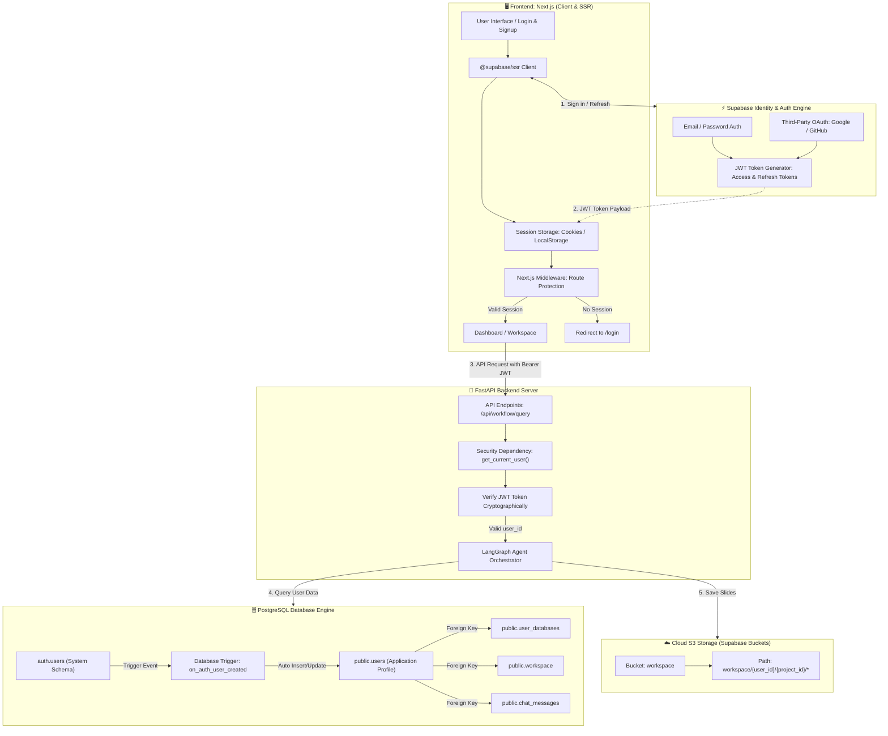
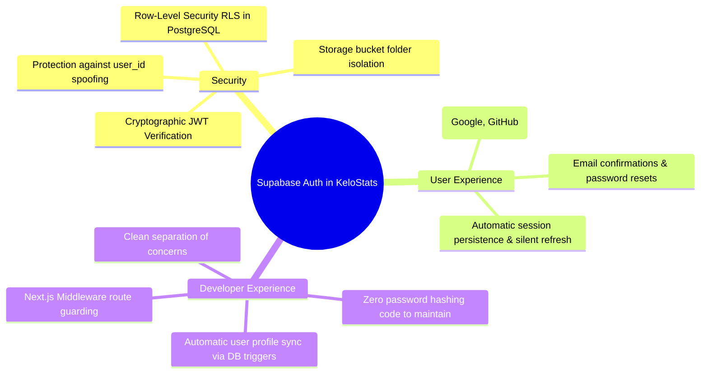

# 🔐 Integrating Supabase Auth into KeloStats: Complete Architectural Guide

This document explains how to integrate **Supabase Authentication** into the existing KeloStats project, transitioning from basic custom table authentication (bcrypt + localStorage) to an enterprise-grade, token-based authentication system with **JWT validation**, **Row Level Security (RLS)**, and **secure cloud storage isolation**.

---

## 1. End-to-End System Architecture



---

## 2. High-Level Component Flow Diagram



---

## 3. Why Switch from Current Auth to Supabase Auth?

| Feature | Current Implementation (`login.py` & `signup.py`) | With Supabase Auth |
|---|---|---|
| **Password Security** | Custom bcrypt hashing in local Python code | Enterprise-grade Argon2/bcrypt handled automatically by Supabase GoTrue |
| **Session Management** | Plain user object stored in browser `localStorage` (vulnerable to XSS) | Cryptographic **JWT Access Tokens** (1 hour) + automated **Refresh Tokens** |
| **Backend Verification** | Relies on client sending unverified `user_id` strings in body | FastAPI cryptographically validates the signed JWT signature from `Authorization` header |
| **Social Login (OAuth)** | Not supported (requires building Google/GitHub OAuth flows from scratch) | 1-click toggle for Google, GitHub, Azure, etc. |
| **Data Isolation** | Manual `WHERE user_id = :user_id` filtering in every SQL query | Native **Row Level Security (RLS)** in PostgreSQL protecting tables automatically |
| **Storage Security** | S3 bucket files are public or require backend proxy | S3 Storage policies restrict access so users can only read/write their own `{user_id}/*` prefix |

---

## 4. Step-by-Step Implementation Roadmap

### Step 1: Database Synchronization (The PostgreSQL Trigger)
When users register via Supabase Auth, they are created in the internal `auth.users` table. To keep your existing `public.users`, `user_databases`, and `workspace` tables working without any broken foreign keys, run this SQL script in your **Supabase SQL Editor**:

```sql
-- 1. Create automatic sync function
CREATE OR REPLACE FUNCTION public.handle_new_user()
RETURNS TRIGGER AS $$
BEGIN
  INSERT INTO public.users (user_id, email, full_name, created_at)
  VALUES (
    NEW.id,
    NEW.email,
    COALESCE(NEW.raw_user_meta_data->>'full_name', split_part(NEW.email, '@', 1)),
    NOW()
  )
  ON CONFLICT (user_id) DO UPDATE
  SET email = EXCLUDED.email,
      full_name = EXCLUDED.full_name;
  RETURN NEW;
END;
$$ LANGUAGE plpgsql SECURITY DEFINER;

-- 2. Bind trigger to Supabase auth.users table
DROP TRIGGER IF EXISTS on_auth_user_created ON auth.users;
CREATE TRIGGER on_auth_user_created
  AFTER INSERT ON auth.users
  FOR EACH ROW EXECUTE PROCEDURE public.handle_new_user();
```

---

### Step 2: Frontend Setup (Next.js)

#### 1. Install Supabase Client Libraries
```bash
cd frontend
npm install @supabase/supabase-js @supabase/ssr
```

#### 2. Configure Supabase Client Helper (`frontend/lib/supabase/client.ts`)
```typescript
import { createBrowserClient } from "@supabase/ssr";

export function createClient() {
  return createBrowserClient(
    process.env.NEXT_PUBLIC_SUPABASE_URL!,
    process.env.NEXT_PUBLIC_SUPABASE_ANON_KEY!
  );
}
```

#### 3. Update Frontend Login (`frontend/app/login/page.tsx`)
Replace custom `fetch('/api/auth/login')` with native Supabase Auth:
```typescript
import { createClient } from "@/lib/supabase/client";

const supabase = createClient();

const handleLogin = async (e: React.FormEvent) => {
  e.preventDefault();
  const { data, error } = await supabase.auth.signInWithPassword({
    email: email.trim(),
    password: password,
  });

  if (error) {
    setError(error.message);
    return;
  }

  // Session token is now stored securely by Supabase
  router.push("/dashboard");
};
```

#### 4. Route Protection Middleware (`frontend/middleware.ts`)
Ensures unauthenticated users cannot access `/dashboard` or `/workspace`:
```typescript
import { createServerClient } from "@supabase/ssr";
import { NextResponse, type NextRequest } from "next/server";

export async function middleware(request: NextRequest) {
  let response = NextResponse.next({ request: { headers: request.headers } });

  const supabase = createServerClient(
    process.env.NEXT_PUBLIC_SUPABASE_URL!,
    process.env.NEXT_PUBLIC_SUPABASE_ANON_KEY!,
    {
      cookies: {
        getAll() { return request.cookies.getAll(); },
        setAll(cookiesToSet) {
          cookiesToSet.forEach(({ name, value, options }) =>
            response.cookies.set(name, value, options)
          );
        },
      },
    }
  );

  const { data: { user } } = await supabase.auth.getUser();

  if (!user && request.nextUrl.pathname.startsWith("/dashboard")) {
    return NextResponse.redirect(new URL("/login", request.url));
  }

  return response;
}

export const config = {
  matcher: ["/dashboard/:path*"],
};
```

---

### Step 3: FastAPI Backend Authentication (JWT Verification)

In the backend, verify the incoming Supabase JWT token so users cannot spoof another user's `user_id`.

#### 1. Install PyJWT & Cryptography in Backend
```bash
cd backend
pip install pyjwt cryptography
```

#### 2. Create JWT Verification Dependency (`backend/auth/supabase_jwt.py`)
```python
import os
import jwt
from fastapi import Depends, HTTPException, status
from fastapi.security import HTTPBearer, HTTPAuthorizationCredentials

security = HTTPBearer()
SUPABASE_JWT_SECRET = os.getenv("SUPABASE_JWT_SECRET")

def get_current_user_id(credentials: HTTPAuthorizationCredentials = Depends(security)) -> str:
    """
    Validates Supabase Bearer JWT and extracts the authenticated user_id (sub).
    """
    token = credentials.credentials
    try:
        # Decode and verify Supabase HS256 JWT
        payload = jwt.decode(
            token,
            SUPABASE_JWT_SECRET,
            algorithms=["HS256"],
            audience="authenticated"
        )
        user_id: str = payload.get("sub")
        if not user_id:
            raise HTTPException(
                status_code=status.HTTP_401_UNAUTHORIZED,
                detail="Token missing subject (user_id)."
            )
        return user_id
    except jwt.ExpiredSignatureError:
        raise HTTPException(
            status_code=status.HTTP_401_UNAUTHORIZED,
            detail="Session has expired. Please log in again."
        )
    except jwt.PyJWTError as e:
        raise HTTPException(
            status_code=status.HTTP_401_UNAUTHORIZED,
            detail=f"Invalid authentication credentials: {str(e)}"
        )
```

#### 3. Protect FastAPI Endpoints (`backend/workflow/orchestrator.py`)
```python
from auth.supabase_jwt import get_current_user_id

@router.post("/api/workflow/query")
def workflow_query_endpoint(
    payload: QueryWorkflowRequest,
    authenticated_user_id: str = Depends(get_current_user_id) # Enforces valid token!
):
    # Overwrite payload user_id with the verified cryptographic identity
    target_user_id = authenticated_user_id
    
    # Run LangGraph workflow safely isolated to this user
    return run_orchestrator(
        user_query=payload.user_query,
        database_id=payload.database_id,
        project_id=payload.project_id,
        user_id=target_user_id,
        slide_number=payload.slide_number
    )
```

---

### Step 4: Storage Security (Supabase S3 Isolation)

Since KeloStats uploads generated slides to:
`workspace/{user_id}/{project_id}/slides/{uuid}.html`

You can add a **Supabase Storage Policy** in the dashboard:
```sql
-- Allow users to only read and upload within their own user_id directory
CREATE POLICY "Allow User Workspace Isolation"
ON storage.objects FOR ALL
TO authenticated
USING ( bucket_id = 'workspace' AND (storage.foldername(name))[1] = auth.uid()::text )
WITH CHECK ( bucket_id = 'workspace' AND (storage.foldername(name))[1] = auth.uid()::text );
```

---

## 5. Summary of Benefits



By adding **Supabase Auth**, KeloStats evolves from a prototype with basic local credentials into a **secure, multi-tenant SaaS architecture** ready for enterprise deployment.
